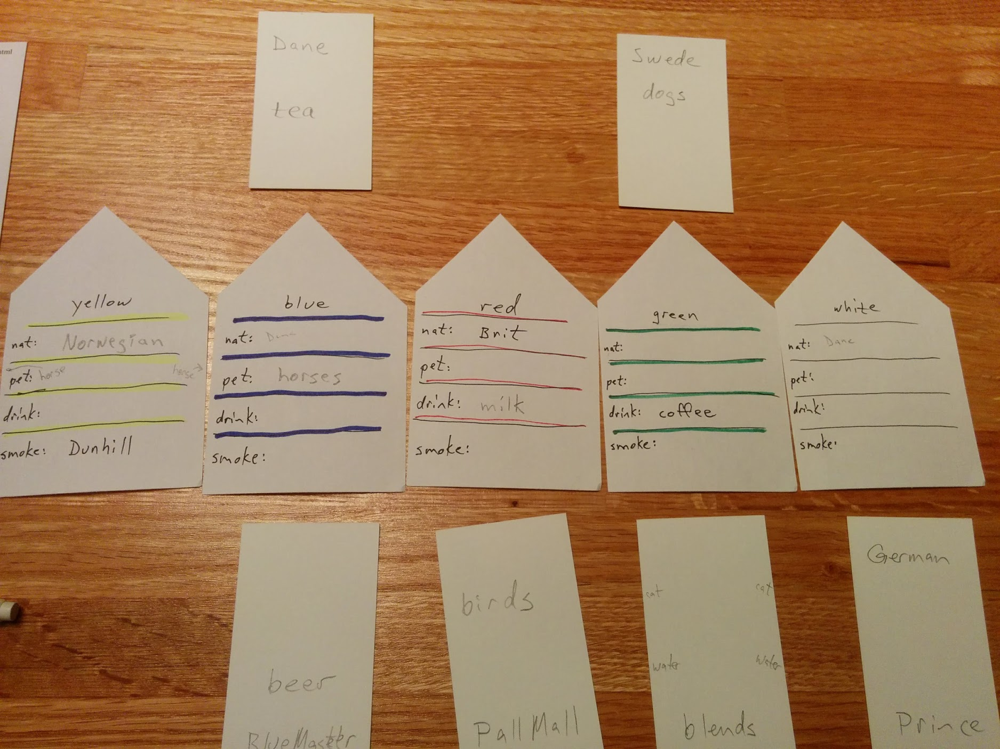
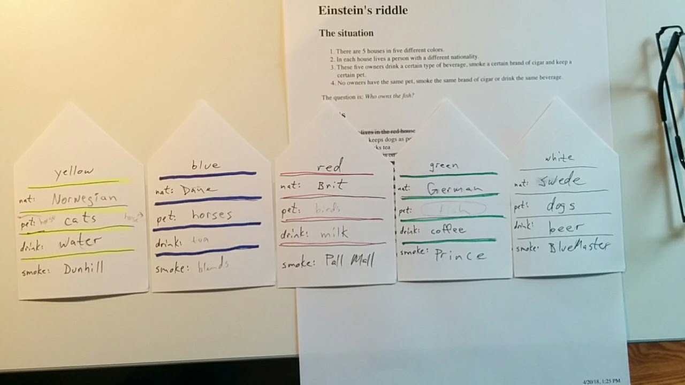

Constraint Modeling with Albert Einstein
========================================

### Ideas

- solving by hand
- model
- assertions
- brute force
- The Mathematics
- Next Steps
- presentation/teaching drama (hats, cigars, cups, stuffed animals, house color, address numbers)

### References

[1](https://support.onefact.net/issues/10321) Write Einstein's Riddle  
[2](https://en.wikipedia.org/wiki/Zebra_Puzzle) Zebra Puzzle  
[3](https://en.wikipedia.org/wiki/Manipulative_(mathematics_education)) manipulative  

---------------------------------

### Abstract
_Einstein's Riddle_ (also known as the _Zebra Puzzle_ [2]) is a
multi-dimensional constraint satisfaction problem which is captivating,
challenging and solvable by humans with or without
computing machinery.  It serves as an entertaining platform for the study
of constraint satisfaction problems and tools.  This paper presents a solver
of Einstein's Riddle modeled in xtUML.  Constraints are modeled as links
between instances of UML classes.

### Introduction
Albert Einstein is credited with a riddle which goes something like:

There are 5 houses in five different colors.  
In each house lives a person with a different nationality.  
These five owners drink a certain type of beverage, smoke  
a certain brand of cigar and keep a certain pet.  
No owners have the same pet, smoke the same brand of cigar  
or drink the same beverage.  

...followed by a question:

Who owns the fish?

'Hints' follow that amount to constraints on the system. For example,

- The Brit lives in the red house.
- The Swede keeps dogs as pets.

The hints constrain the problem such that there is exactly one solution.
The riddle offers information that can be captured in a relational class
model rich in associations and instances. Such a model has been built
and its capabilities, advantages and disadvantages are explored.

This paper reports the experience of modeling Einstein's Riddle in Executable UML (xtUML).
The riddle has been solved in other languages specific to Satisfiability Modulo Theories (SMT).
?? The general purpose UML model is compared and contrasted with SMT solvers (such as one implemented in Z3).
?? The applicability of SMT tree walker/solvers to executable UML metamodels is explored.
Observations are made and questions for future work are raised.

### Solving by Hand
I was introduced to Einstein's Riddle by a friend.  He had recently learned
about it and solved it himself.  Upon receiving it, I looked and noticed that
it seemed solvable on the surface.  At home, I spent 20 minutes noodling with
it using a scratch piece of paper.  This further confirmed to my mind that
the problem was challenging but solvable by hand, but that it would take a
methodical approach and more time.

I needed _manipulatives_ [3] to help me solve the riddle.
So, I cut out paper houses and colored them with five different colors.
I ordered the houses on the table in front of me from left to right to represent the address of the house.
From business cards, I crafted labels with the identifiers of the owners, beverages, pets and tobaccos.
Each house had a space to place the owner, beverage, pet and tobacco label.
Sometimes, I would put a label "between" two houses to show some affinity toward a specific house or owner.

### The Mathematics
### xtUML Model
#### Assertions
#### Brute Force
### Next Steps
